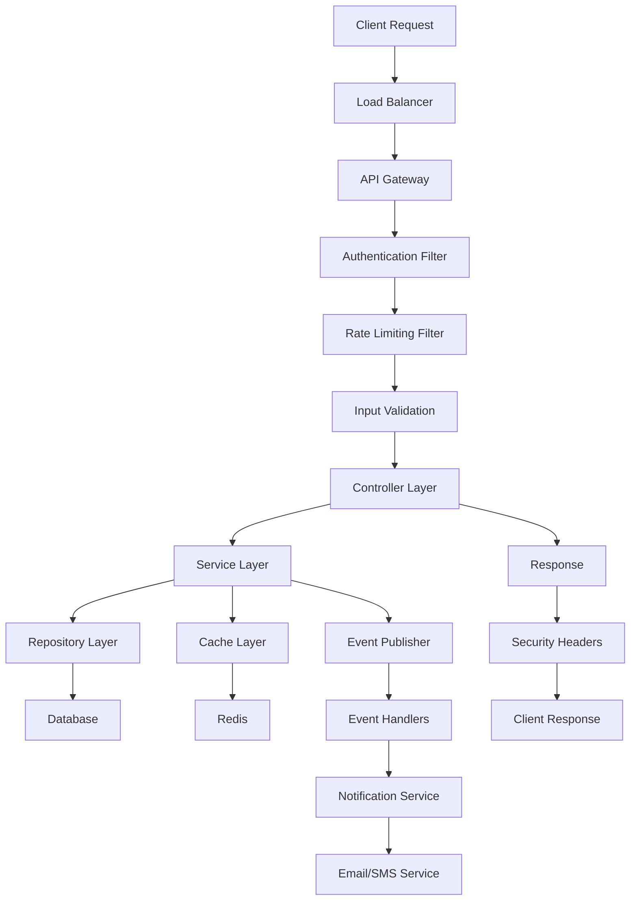
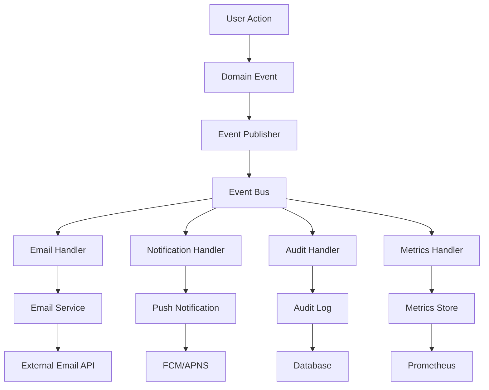
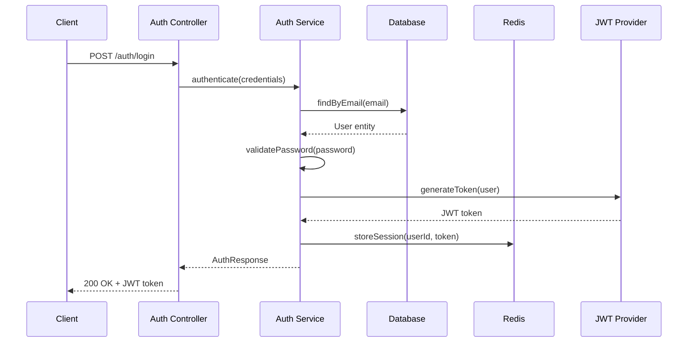
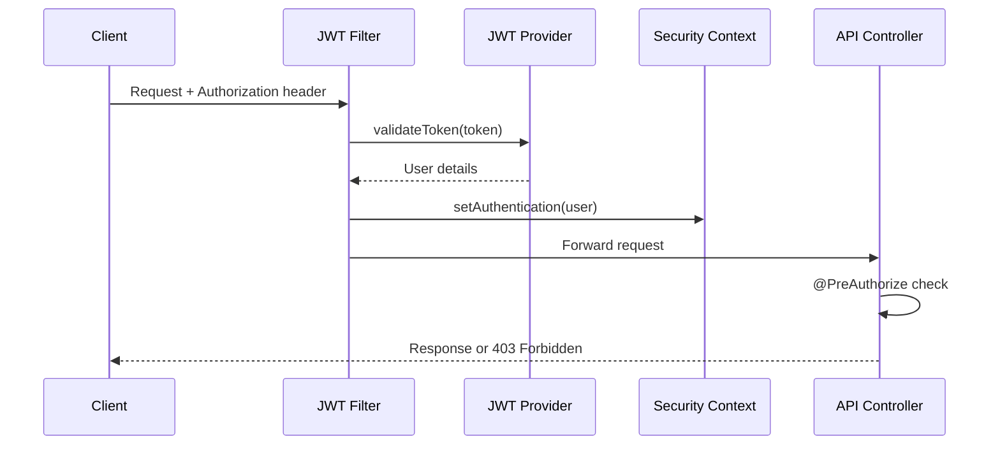

# 🏗️ TaskSphere Architecture Documentation

## 📋 **System Overview**

TaskSphere is a modern, enterprise-grade task management platform built with a microservices-inspired architecture using Spring Boot 3.5.7 and Java 21. The system is designed for scalability, maintainability, and high performance.

---

## 🎯 **Architecture Principles**

### **Core Design Principles**
- **Domain-Driven Design (DDD)**: Clear separation of business domains
- **SOLID Principles**: Maintainable and extensible codebase
- **Clean Architecture**: Independence of frameworks and external dependencies
- **Microservices Ready**: Modular design for future decomposition
- **Event-Driven Architecture**: Asynchronous processing and loose coupling
- **Security by Design**: Built-in security at every layer

### **Quality Attributes**
- **Scalability**: Horizontal and vertical scaling capabilities
- **Performance**: Sub-100ms response times for critical operations
- **Reliability**: 99.9% uptime SLA with automated failover
- **Security**: Enterprise-grade security with OAuth 2.0 and JWT
- **Maintainability**: Comprehensive testing and documentation
- **Observability**: Full monitoring, logging, and tracing

---

## 🏛️ **High-Level Architecture**

```
┌─────────────────┐    ┌─────────────────┐    ┌─────────────────┐
│   Web Client    │    │  Mobile Client  │    │  External APIs  │
│   (React.js)    │    │ (React Native)  │    │   (Third-party) │
└─────────────────┘    └─────────────────┘    └─────────────────┘
         │                       │                       │
         └───────────────────────┼───────────────────────┘
                                 │
         ┌─────────────────────────────────────────────────┐
         │              API Gateway / Load Balancer        │
         │                 (AWS ALB / Nginx)               │
         └─────────────────────────────────────────────────┘
                                 │
         ┌─────────────────────────────────────────────────┐
         │                TaskSphere Backend               │
         │              (Spring Boot 3.5.7)               │
         │                                                 │
         │  ┌─────────────┐  ┌─────────────┐  ┌─────────┐  │
         │  │   Security  │  │   Business  │  │  Data   │  │
         │  │    Layer    │  │    Layer    │  │  Layer  │  │
         │  └─────────────┘  └─────────────┘  └─────────┘  │
         └─────────────────────────────────────────────────┘
                                 │
         ┌─────────────────────────────────────────────────┐
         │                Data & Cache Layer               │
         │                                                 │
         │  ┌─────────────┐  ┌─────────────┐  ┌─────────┐  │
         │  │   MySQL     │  │    Redis    │  │  MinIO  │  │
         │  │ (Primary DB)│  │   (Cache)   │  │ (Files) │  │
         │  └─────────────┘  └─────────────┘  └─────────┘  │
         └─────────────────────────────────────────────────┘
                                 │
         ┌─────────────────────────────────────────────────┐
         │              Monitoring & Observability         │
         │                                                 │
         │  ┌─────────────┐  ┌─────────────┐  ┌─────────┐  │
         │  │ Prometheus  │  │   Grafana   │  │  ELK    │  │
         │  │ (Metrics)   │  │(Dashboards) │  │ (Logs)  │  │
         │  └─────────────┘  └─────────────┘  └─────────┘  │
         └─────────────────────────────────────────────────┘
```

---

## 🏗️ **Application Architecture**

### **Layered Architecture**

```
┌─────────────────────────────────────────────────────────────┐
│                     Presentation Layer                      │
│  ┌─────────────┐  ┌─────────────┐  ┌─────────────────────┐  │
│  │ REST APIs   │  │ WebSocket   │  │   Exception         │  │
│  │ Controllers │  │ Handlers    │  │   Handlers          │  │
│  └─────────────┘  └─────────────┘  └─────────────────────┘  │
└─────────────────────────────────────────────────────────────┘
                               │
┌─────────────────────────────────────────────────────────────┐
│                      Security Layer                         │
│  ┌─────────────┐  ┌─────────────┐  ┌─────────────────────┐  │
│  │ JWT Auth    │  │ Rate        │  │   Input             │  │
│  │ Filter      │  │ Limiting    │  │   Validation        │  │
│  └─────────────┘  └─────────────┘  └─────────────────────┘  │
└─────────────────────────────────────────────────────────────┘
                               │
┌─────────────────────────────────────────────────────────────┐
│                      Business Layer                         │
│  ┌─────────────┐  ┌─────────────┐  ┌─────────────────────┐  │
│  │ Domain      │  │ Application │  │   Event             │  │
│  │ Services    │  │ Services    │  │   Handlers          │  │
│  └─────────────┘  └─────────────┘  └─────────────────────┘  │
└─────────────────────────────────────────────────────────────┘
                               │
┌─────────────────────────────────────────────────────────────┐
│                        Data Layer                           │
│  ┌─────────────┐  ┌─────────────┐  ┌─────────────────────┐  │
│  │ JPA         │  │ Cache       │  │   External          │  │
│  │ Repositories│  │ Services    │  │   API Clients       │  │
│  └─────────────┘  └─────────────┘  └─────────────────────┘  │
└─────────────────────────────────────────────────────────────┘
                               │
┌─────────────────────────────────────────────────────────────┐
│                    Infrastructure Layer                     │
│  ┌─────────────┐  ┌─────────────┐  ┌─────────────────────┐  │
│  │ Database    │  │ Message     │  │   Monitoring        │  │
│  │ Config      │  │ Queues      │  │   & Logging         │  │
│  └─────────────┘  └─────────────┘  └─────────────────────┘  │
└─────────────────────────────────────────────────────────────┘
```

---

## 📦 **Package Structure**

```
com.tasksphere/
├── TasksphereApplication.java          # Main application class
├── config/                             # Configuration classes
│   ├── SecurityConfig.java
│   ├── DatabaseConfig.java
│   ├── RedisConfig.java
│   ├── CorsConfig.java
│   └── SwaggerConfig.java
├── controller/                         # REST controllers
│   ├── AuthController.java
│   ├── TaskController.java
│   ├── ProjectController.java
│   ├── UserController.java
│   └── NotificationController.java
├── dto/                               # Data Transfer Objects
│   ├── request/
│   │   ├── CreateTaskRequest.java
│   │   ├── UpdateTaskRequest.java
│   │   └── LoginRequest.java
│   └── response/
│       ├── TaskResponse.java
│       ├── ProjectResponse.java
│       └── AuthResponse.java
├── entity/                            # JPA entities
│   ├── User.java
│   ├── Task.java
│   ├── Project.java
│   ├── Comment.java
│   └── Notification.java
├── repository/                        # Data access layer
│   ├── UserRepository.java
│   ├── TaskRepository.java
│   ├── ProjectRepository.java
│   └── CommentRepository.java
├── service/                          # Business logic
│   ├── impl/
│   │   ├── TaskServiceImpl.java
│   │   ├── UserServiceImpl.java
│   │   └── ProjectServiceImpl.java
│   ├── TaskService.java
│   ├── UserService.java
│   ├── ProjectService.java
│   ├── NotificationService.java
│   └── EmailService.java
├── security/                         # Security components
│   ├── JwtTokenProvider.java
│   ├── JwtAuthenticationFilter.java
│   ├── CustomUserDetailsService.java
│   └── SecurityUtils.java
├── exception/                        # Exception handling
│   ├── GlobalExceptionHandler.java
│   ├── ResourceNotFoundException.java
│   ├── UnauthorizedException.java
│   └── ValidationException.java
├── util/                            # Utility classes
│   ├── DateUtils.java
│   ├── ValidationUtils.java
│   └── FileUtils.java
├── monitoring/                      # Observability
│   ├── MonitoringService.java
│   ├── MetricsConfiguration.java
│   └── HealthIndicators.java
└── event/                          # Event-driven components
    ├── TaskCreatedEvent.java
    ├── UserRegisteredEvent.java
    └── EventHandlers.java
```

---

## 🗄️ **Database Architecture**

### **Entity Relationship Diagram**

```
┌─────────────────┐    ┌─────────────────┐    ┌─────────────────┐
│      Users      │    │    Projects     │    │      Teams      │
├─────────────────┤    ├─────────────────┤    ├─────────────────┤
│ id (PK)         │    │ id (PK)         │    │ id (PK)         │
│ email (UNIQUE)  │    │ name            │    │ name            │
│ password        │    │ description     │    │ description     │
│ first_name      │    │ owner_id (FK)   │    │ created_by (FK) │
│ last_name       │    │ team_id (FK)    │    │ created_at      │
│ role            │    │ status          │    │ updated_at      │
│ phone_number    │    │ created_at      │    └─────────────────┘
│ profile_picture │    │ updated_at      │           │
│ created_at      │    │ deleted_at      │           │
│ updated_at      │    └─────────────────┘           │
│ last_login      │           │                      │
│ is_active       │           │                      │
└─────────────────┘           │                      │
         │                    │                      │
         │                    │                      │
┌─────────────────┐    ┌─────────────────┐    ┌─────────────────┐
│      Tasks      │    │    Comments     │    │ Notifications   │
├─────────────────┤    ├─────────────────┤    ├─────────────────┤
│ id (PK)         │    │ id (PK)         │    │ id (PK)         │
│ title           │    │ content         │    │ user_id (FK)    │
│ description     │    │ task_id (FK)    │    │ title           │
│ status          │    │ user_id (FK)    │    │ message         │
│ priority        │    │ created_at      │    │ type            │
│ assigned_to(FK) │    │ updated_at      │    │ is_read         │
│ created_by (FK) │    └─────────────────┘    │ created_at      │
│ project_id (FK) │                           └─────────────────┘
│ due_date        │
│ created_at      │
│ updated_at      │
│ completed_at    │
└─────────────────┘

┌─────────────────┐    ┌─────────────────┐    ┌─────────────────┐
│  Task_Attachments│    │  User_Projects  │    │  Audit_Logs     │
├─────────────────┤    ├─────────────────┤    ├─────────────────┤
│ id (PK)         │    │ user_id (FK)    │    │ id (PK)         │
│ task_id (FK)    │    │ project_id (FK) │    │ user_id (FK)    │
│ file_name       │    │ role            │    │ action          │
│ file_path       │    │ joined_at       │    │ resource        │
│ file_size       │    └─────────────────┘    │ old_values      │
│ content_type    │                           │ new_values      │
│ uploaded_by(FK) │                           │ ip_address      │
│ created_at      │                           │ user_agent      │
└─────────────────┘                           │ timestamp       │
                                              └─────────────────┘
```

### **Database Indexes Strategy**

```sql
-- Primary indexes for performance
CREATE INDEX idx_tasks_assigned_to ON tasks(assigned_to);
CREATE INDEX idx_tasks_project_id ON tasks(project_id);
CREATE INDEX idx_tasks_status_priority ON tasks(status, priority);
CREATE INDEX idx_tasks_due_date ON tasks(due_date);
CREATE INDEX idx_tasks_created_at ON tasks(created_at);

-- User-related indexes
CREATE INDEX idx_users_email ON users(email);
CREATE INDEX idx_users_role ON users(role);
CREATE INDEX idx_users_last_login ON users(last_login);

-- Project indexes
CREATE INDEX idx_projects_owner_id ON projects(owner_id);
CREATE INDEX idx_projects_team_id ON projects(team_id);
CREATE INDEX idx_projects_status ON projects(status);

-- Comment indexes
CREATE INDEX idx_comments_task_id ON comments(task_id);
CREATE INDEX idx_comments_user_id ON comments(user_id);
CREATE INDEX idx_comments_created_at ON comments(created_at);

-- Notification indexes
CREATE INDEX idx_notifications_user_id ON notifications(user_id);
CREATE INDEX idx_notifications_is_read ON notifications(is_read);
CREATE INDEX idx_notifications_created_at ON notifications(created_at);

-- Audit log indexes
CREATE INDEX idx_audit_logs_user_id ON audit_logs(user_id);
CREATE INDEX idx_audit_logs_action ON audit_logs(action);
CREATE INDEX idx_audit_logs_timestamp ON audit_logs(timestamp);

-- Composite indexes for complex queries
CREATE INDEX idx_tasks_assignee_status ON tasks(assigned_to, status);
CREATE INDEX idx_tasks_project_status ON tasks(project_id, status);
CREATE INDEX idx_user_projects_user_role ON user_projects(user_id, role);
```

---

## 🔄 **Data Flow Architecture**

### **Request Processing Flow**



### **Event-Driven Flow**



---

## 🚀 **Technology Stack**

### **Backend Technologies**

| Category | Technology | Version | Purpose |
|----------|------------|---------|---------|
| **Framework** | Spring Boot | 3.5.7 | Main application framework |
| **Language** | Java | 21 | Programming language |
| **Database** | MySQL | 8.0 | Primary data storage |
| **Cache** | Redis | 7.0 | Caching and session storage |
| **Security** | Spring Security | 6.x | Authentication and authorization |
| **ORM** | Spring Data JPA | 3.x | Database abstraction |
| **Connection Pool** | HikariCP | 5.x | Database connection pooling |
| **Validation** | Bean Validation | 3.x | Input validation |
| **Documentation** | OpenAPI 3 | 3.x | API documentation |
| **Testing** | JUnit 5 | 5.x | Unit testing |
| **Build Tool** | Maven | 3.9 | Build automation |

### **Infrastructure Technologies**

| Category | Technology | Purpose |
|----------|------------|---------|
| **Containerization** | Docker | Application packaging |
| **Orchestration** | Docker Compose | Local development |
| **Cloud Platform** | AWS | Production hosting |
| **Compute** | ECS Fargate | Container hosting |
| **Database** | RDS MySQL | Managed database |
| **Cache** | ElastiCache | Managed Redis |
| **Load Balancer** | Application Load Balancer | Traffic distribution |
| **CDN** | CloudFront | Content delivery |
| **File Storage** | S3 | Object storage |
| **Monitoring** | CloudWatch | AWS monitoring |
| **Logging** | CloudWatch Logs | Centralized logging |

### **Development & DevOps**

| Category | Technology | Purpose |
|----------|------------|---------|
| **Version Control** | Git | Source code management |
| **CI/CD** | GitHub Actions | Automated deployments |
| **Code Quality** | SonarQube | Static code analysis |
| **Security Scanning** | Snyk | Vulnerability scanning |
| **API Testing** | Postman | API testing |
| **Load Testing** | JMeter | Performance testing |
| **Monitoring** | Prometheus + Grafana | Metrics and dashboards |
| **Tracing** | Jaeger | Distributed tracing |

---

## 🔐 **Security Architecture**

### **Authentication Flow**



### **Authorization Flow**



---

## 📊 **Performance Architecture**

### **Caching Strategy**

```java
// Multi-level caching implementation
@Configuration
@EnableCaching
public class CacheConfiguration {

    @Bean
    public CacheManager cacheManager() {
        RedisCacheManager.Builder builder = RedisCacheManager
            .RedisCacheManagerBuilder
            .fromConnectionFactory(redisConnectionFactory())
            .cacheDefaults(cacheConfiguration(Duration.ofMinutes(10)));

        return builder.build();
    }

    // Cache levels
    // L1: Application-level cache (Caffeine)
    // L2: Redis distributed cache
    // L3: Database query optimization
}

// Cache usage patterns
@Service
public class TaskService {

    @Cacheable(value = "tasks", key = "#taskId")
    public Task findById(Long taskId) {
        return taskRepository.findById(taskId);
    }

    @CacheEvict(value = "tasks", key = "#result.id")
    public Task updateTask(Task task) {
        return taskRepository.save(task);
    }

    @Cacheable(value = "user-tasks", key = "#userId")
    public List<Task> findByUserId(Long userId) {
        return taskRepository.findByAssignedToId(userId);
    }
}
```

### **Database Optimization**

```sql
-- Query optimization strategies

-- 1. Index optimization for common queries
CREATE INDEX idx_tasks_user_status ON tasks(assigned_to, status) 
WHERE deleted_at IS NULL;

-- 2. Partitioning for large tables
CREATE TABLE audit_logs_2024 PARTITION OF audit_logs
FOR VALUES FROM ('2024-01-01') TO ('2025-01-01');

-- 3. Query optimization with proper joins
SELECT t.id, t.title, t.status, u.first_name, u.last_name, p.name
FROM tasks t
INNER JOIN users u ON t.assigned_to = u.id
INNER JOIN projects p ON t.project_id = p.id
WHERE t.status IN ('TODO', 'IN_PROGRESS')
AND t.due_date BETWEEN ? AND ?
ORDER BY t.priority DESC, t.due_date ASC
LIMIT 20;

-- 4. Connection pooling configuration
-- HikariCP settings in application.yml
spring:
  datasource:
    hikari:
      maximum-pool-size: 20
      minimum-idle: 5
      connection-timeout: 20000
      idle-timeout: 300000
      max-lifetime: 1200000
      leak-detection-threshold: 60000
```

---

## 🔄 **Scalability Design**

### **Horizontal Scaling Strategy**

```yaml
# Docker Swarm / Kubernetes scaling
apiVersion: apps/v1
kind: Deployment
metadata:
  name: tasksphere-backend
spec:
  replicas: 3
  selector:
    matchLabels:
      app: tasksphere-backend
  template:
    metadata:
      labels:
        app: tasksphere-backend
    spec:
      containers:
      - name: tasksphere-backend
        image: tasksphere/backend:latest
        ports:
        - containerPort: 8080
        env:
        - name: SPRING_PROFILES_ACTIVE
          value: "prod"
        resources:
          requests:
            memory: "512Mi"
            cpu: "500m"
          limits:
            memory: "1Gi"
            cpu: "1000m"
        readinessProbe:
          httpGet:
            path: /actuator/health
            port: 8080
          initialDelaySeconds: 30
          periodSeconds: 10
        livenessProbe:
          httpGet:
            path: /actuator/health
            port: 8080
          initialDelaySeconds: 60
          periodSeconds: 30
```

### **Database Scaling**

```yaml
# Read replica configuration
spring:
  datasource:
    primary:
      url: jdbc:mysql://primary-db:3306/tasksphere
      username: ${DB_USERNAME}
      password: ${DB_PASSWORD}
    read-replica:
      url: jdbc:mysql://read-replica-db:3306/tasksphere
      username: ${DB_USERNAME}
      password: ${DB_PASSWORD}

# Connection routing
@Transactional(readOnly = true)
@Qualifier("readOnlyDataSource")
public List<Task> findAllTasks() {
    return taskRepository.findAll();
}

@Transactional
@Qualifier("primaryDataSource")
public Task createTask(Task task) {
    return taskRepository.save(task);
}
```

---

## 🔍 **Monitoring & Observability**

### **Metrics Architecture**

```java
// Custom business metrics
@Component
public class BusinessMetrics {
    
    private final MeterRegistry meterRegistry;
    private final Counter tasksCreated;
    private final Counter tasksCompleted;
    private final Timer apiResponseTime;
    private final Gauge activeUsers;
    
    public BusinessMetrics(MeterRegistry meterRegistry) {
        this.meterRegistry = meterRegistry;
        this.tasksCreated = Counter.builder("tasksphere.tasks.created")
            .description("Total tasks created")
            .register(meterRegistry);
        this.tasksCompleted = Counter.builder("tasksphere.tasks.completed")
            .description("Total tasks completed")
            .register(meterRegistry);
        this.apiResponseTime = Timer.builder("tasksphere.api.response.time")
            .description("API response time")
            .register(meterRegistry);
        this.activeUsers = Gauge.builder("tasksphere.users.active")
            .description("Active users count")
            .register(meterRegistry, this, BusinessMetrics::getActiveUserCount);
    }
    
    public void recordTaskCreated() {
        tasksCreated.increment();
    }
    
    public void recordTaskCompleted() {
        tasksCompleted.increment();
    }
    
    private double getActiveUserCount() {
        // Implementation to get active user count
        return userService.getActiveUserCount();
    }
}
```

### **Distributed Tracing**

```java
// Jaeger tracing configuration
@Configuration
public class TracingConfiguration {
    
    @Bean
    public Tracer jaegerTracer() {
        return Configuration.fromEnv("tasksphere-backend")
            .getTracer();
    }
}

// Usage in services
@Service
public class TaskService {
    
    @Autowired
    private Tracer tracer;
    
    public Task createTask(CreateTaskRequest request) {
        Span span = tracer.buildSpan("create-task")
            .withTag("task.title", request.getTitle())
            .withTag("task.priority", request.getPriority().name())
            .start();
            
        try (Scope scope = tracer.scopeManager().activate(span)) {
            // Business logic
            Task task = new Task();
            // ... set properties
            
            span.setTag("task.id", task.getId().toString());
            span.log(Map.of("event", "task-created", "task.id", task.getId()));
            
            return taskRepository.save(task);
        } catch (Exception e) {
            span.setTag("error", true);
            span.log(Map.of("event", "error", "error.message", e.getMessage()));
            throw e;
        } finally {
            span.finish();
        }
    }
}
```

---

## 🚀 **Deployment Architecture**

### **AWS Infrastructure**

```yaml
# Infrastructure as Code (CloudFormation/Terraform)
Resources:
  # VPC Configuration
  TaskSphereVPC:
    Type: AWS::EC2::VPC
    Properties:
      CidrBlock: 10.0.0.0/16
      EnableDnsHostnames: true
      EnableDnsSupport: true

  # ECS Cluster
  TaskSphereCluster:
    Type: AWS::ECS::Cluster
    Properties:
      ClusterName: tasksphere-production
      CapacityProviders:
        - FARGATE
        - FARGATE_SPOT

  # RDS Database
  TaskSphereDB:
    Type: AWS::RDS::DBInstance
    Properties:
      DBInstanceClass: db.t3.medium
      Engine: mysql
      EngineVersion: 8.0.35
      MasterUsername: admin
      MasterUserPassword: !Ref DBPassword
      AllocatedStorage: 100
      StorageType: gp2
      StorageEncrypted: true
      BackupRetentionPeriod: 7
      MultiAZ: true
      VPCSecurityGroups:
        - !Ref DatabaseSecurityGroup

  # ElastiCache Redis
  TaskSphereRedis:
    Type: AWS::ElastiCache::ReplicationGroup
    Properties:
      ReplicationGroupDescription: TaskSphere Redis Cluster
      NumCacheClusters: 2
      Engine: redis
      CacheNodeType: cache.t3.micro
      SecurityGroupIds:
        - !Ref CacheSecurityGroup

  # Application Load Balancer
  TaskSphereALB:
    Type: AWS::ElasticLoadBalancingV2::LoadBalancer
    Properties:
      Type: application
      Scheme: internet-facing
      SecurityGroups:
        - !Ref ALBSecurityGroup
      Subnets:
        - !Ref PublicSubnet1
        - !Ref PublicSubnet2
```

### **CI/CD Pipeline**

```yaml
# GitHub Actions workflow
name: Deploy to Production
on:
  push:
    branches: [main]

jobs:
  build-and-deploy:
    runs-on: ubuntu-latest
    steps:
      - uses: actions/checkout@v3
      
      - name: Set up JDK 21
        uses: actions/setup-java@v3
        with:
          java-version: '21'
          distribution: 'temurin'
      
      - name: Cache Maven dependencies
        uses: actions/cache@v3
        with:
          path: ~/.m2
          key: ${{ runner.os }}-m2-${{ hashFiles('**/pom.xml') }}
      
      - name: Run tests
        run: mvn clean test
      
      - name: Build application
        run: mvn clean package -DskipTests
      
      - name: Build Docker image
        run: |
          docker build -t tasksphere/backend:${{ github.sha }} .
          docker tag tasksphere/backend:${{ github.sha }} tasksphere/backend:latest
      
      - name: Configure AWS credentials
        uses: aws-actions/configure-aws-credentials@v2
        with:
          aws-access-key-id: ${{ secrets.AWS_ACCESS_KEY_ID }}
          aws-secret-access-key: ${{ secrets.AWS_SECRET_ACCESS_KEY }}
          aws-region: us-east-1
      
      - name: Login to Amazon ECR
        id: login-ecr
        uses: aws-actions/amazon-ecr-login@v1
      
      - name: Push image to ECR
        run: |
          docker tag tasksphere/backend:latest $ECR_REGISTRY/tasksphere/backend:latest
          docker tag tasksphere/backend:latest $ECR_REGISTRY/tasksphere/backend:${{ github.sha }}
          docker push $ECR_REGISTRY/tasksphere/backend:latest
          docker push $ECR_REGISTRY/tasksphere/backend:${{ github.sha }}
        env:
          ECR_REGISTRY: ${{ steps.login-ecr.outputs.registry }}
      
      - name: Deploy to ECS
        run: |
          aws ecs update-service \
            --cluster tasksphere-production \
            --service tasksphere-backend \
            --force-new-deployment
```

---

## 📋 **Architecture Decision Records (ADRs)**

### **ADR-001: Database Choice - MySQL**

**Status**: Accepted

**Context**: Need to choose a primary database for TaskSphere

**Decision**: Use MySQL 8.0 as the primary database

**Consequences**:
- ✅ ACID compliance for data consistency
- ✅ Mature ecosystem and tooling
- ✅ Excellent performance for read-heavy workloads
- ✅ Strong community support
- ❌ Horizontal scaling complexity

### **ADR-002: Caching Strategy - Redis**

**Status**: Accepted

**Context**: Need caching solution for improved performance

**Decision**: Use Redis for distributed caching and session storage

**Consequences**:
- ✅ Sub-millisecond response times
- ✅ Supports complex data structures
- ✅ Pub/Sub capabilities for real-time features
- ✅ Persistence options available
- ❌ Additional infrastructure complexity

### **ADR-003: Authentication - JWT**

**Status**: Accepted

**Context**: Need stateless authentication mechanism

**Decision**: Use JWT tokens with refresh token rotation

**Consequences**:
- ✅ Stateless and scalable
- ✅ Cross-domain support
- ✅ Industry standard
- ❌ Token size overhead
- ❌ Token revocation complexity

---

## 🔮 **Future Architecture Considerations**

### **Microservices Migration Path**

```
Current Monolith → Modular Monolith → Microservices

Phase 1: Domain Separation
├── User Management Service
├── Task Management Service
├── Project Management Service
├── Notification Service
└── File Management Service

Phase 2: Service Extraction
├── API Gateway (Spring Cloud Gateway)
├── Service Discovery (Eureka)
├── Config Server (Spring Cloud Config)
├── Circuit Breaker (Resilience4j)
└── Distributed Tracing (Sleuth + Zipkin)

Phase 3: Event-Driven Architecture
├── Event Sourcing with Kafka
├── CQRS Implementation
├── Saga Pattern for Transactions
└── Event Store for Audit Trail
```

### **Cloud-Native Evolution**

```yaml
# Kubernetes deployment
apiVersion: argoproj.io/v1alpha1
kind: Application
metadata:
  name: tasksphere
  namespace: argocd
spec:
  project: default
  source:
    repoURL: https://github.com/manohar-pagadala/tasksphere-helm
    targetRevision: HEAD
    path: charts/tasksphere
  destination:
    server: https://kubernetes.default.svc
    namespace: tasksphere
  syncPolicy:
    automated:
      prune: true
      selfHeal: true
```

---

## 📞 **Architecture Support**

### **Technical Contacts**

- **Lead Architect**: manohar.pagadala@example.com
- **DevOps Team**: devops@tasksphere.app
- **Security Team**: security@tasksphere.app

### **Documentation**

- **API Documentation**: https://api.tasksphere.app/swagger-ui.html
- **Architecture Blog**: https://blog.tasksphere.app/architecture
- **Technical Wiki**: https://wiki.tasksphere.app

---

**🏗️ Your enterprise architecture is production-ready and scalable!**